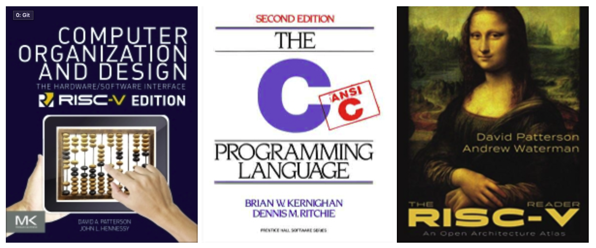

# Estructura de Máquinas

En cursos anteriores han aprendido a programar en un nivel bastante alto de abstracción. Acá nos concentraremos en la máquina y cómo esta ejecuta los programas que ustedes escriben. En este curso nos preocuparemos no tanto por el proceso de escribir un programa de computadora, sino más bien en cómo la computadora ejecuta los programas. Es decir, el tema principal de este curso es la estructura de la máquina: los circuitos electrónicos, y las operaciones computacionales que estos circuitos llevan a cabo. Para concretizar estas ideas, vamos a estudiar con cierto detalle el ISA RISC-V. Usamos este ISA pues es más sencillo que otras familias, mientras que posee características deseables como paralelismo. El detalle semanal de los temas puede ser consultado en la sección de Material de Apoyo del GES.

### Competencias  

* [x] Comprende todas las fases del proceso de ejecución de un programa computacional escrito en código de alto nivel, incluyendo manejo de memoria, arquitectura del set de instrucciones y las operaciones computacionales que se llevan a cabo en los circuitos electrónicos.
* [x] Identifica los componentes principales que forman parte del diseño de la arquitectura de una computadora. 
* [x] Diseña sistemas de hardware y software apoyándose en su conocimiento de los diferentes niveles de abstracción de la estructura y organización de una computadora.
* [x] Implementa sistemas de hardware y software, a través de simulaciones, apoyándose en su conocimiento de los diferentes niveles de abstracción de la estructura y organización de una computadora.

### Requisitos

Para este curso deben sentirse cómodos con la idea de programar, y en la capacidad de aprender lenguajes de programación nuevos sin demasiado esfuerzo. Todo el código que no sea escrito en lenguaje ensamblador será escrito en lenguaje C y Python. Es importante que tengan muy claros los conceptos aprendidos en el curso de estructuras de datos que tomaron en el segundo semestre.

