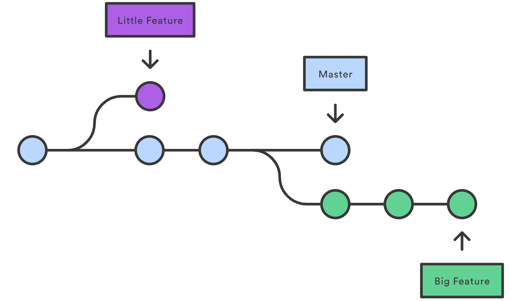

# Lab 0 - Git

## Objetivos

* Aprender git y crear cuenta de GitHub.
* Ganar más intuición para trabajar con números binarios.

## Ejercicio 1: Cuenta de GitHub

Por favor lean las siguientes instrucciones cuidadosamente antes de seguir con el laboratorio. La mayor parte de los problemas que tienen los estudiantes durante este laboratorio se pueden prevenir siguiendo atentamente los pasos que se indican.

Para este curso necesitaremos que utilicen **git**, un _sistema de control de versiones distribuido_. Los sistemas de control de versiones son las mejores herramientas para compartir y almacenar código a comparación de mandar correos con archivos adjuntos, utilizar memorias flash, o incluso compartir documentos mediante DropBox o Google Docs.

Vamos a estar usando **GitHub** para tener repositorios privados en donde van a _almacenar_ su código remotamente. Si la oración anterior no les dijo nada, no se preocupen, vamos a guiarlos en el proceso más adelante. Pero primero, necesitan crear una cuenta de **GitHub**.

¿Por qué GitHub? GitHub ahora le permite a todas las cuentas gratuitas tener repositorios privados ilimitados con algunas limitaciones que no van a ser ningún problema para nosotros.

### GitHub y Primer Repositorio

Naveguen a la siguiente página: [github.com](https://github.com/)

1. Si no tienen una cuenta de GitHub todavía, creen una en el siguiente [link](https://github.com/join/).
2. Creen un repositorio privado vacío, llamado **lab0\_git**
   * Primero hagan click en el siguiente [link](https://github.com/new/)
   * Luego llenen los campos, como se muestra en la siguiente imagen


#### Configurando git <a id="configurando-git"></a>

Ahora que ya hemos creado nuestro repositorio, vamos a configurar git para que sepa quiénes son. Abran una terminal  y ejecuten los siguientes comandos listados abajo, reemplazando **NOMBRE** con su nombre y apellido \(entre comillas\) y **CORREO** con la dirección de correo que utilizarón para registrarse en GitHub.

```text
git config --global user.name "NOMBRE"
```

```text
git config --global user.email "CORREO"
```

## Ejercicio 2: git y Remotes

Primero, algunas definiciones rápidas:

* Un **remote** es la página web host o servidor que va a almacenar su código remotamente en vez de tener únicamente el código de forma local en su propia computadora. Pueden pensar en esto de igual manera a como se almacena un archivo en DropBox o Google Drive pero con el poder que nos da git.
* Un **branch** es una secuencia \(por aparte\) de diferentes cambios a su código. Pueden pensar en los _branches_ como diferentes versiones de su código, que en algún punto fueron lo mismo. La siguiente figura muestra a que nos referimos como branches.



A lo largo de este curso, estarán trabajando en dos diferentes "_computadoras_" que generalmente tendran diferentes versiones de su código en algún tiempo. Estas dos son: su computadora personal y su remote de GitHub \(sus repositorios privados de GitHub\). Es esencial que entiendan la diferencia entre estas dos y como pueden compartir código entre ellas.

1. Su **computadora personal** es la que les servirá para hacer todo el trabajo \(laboratorios y proyectos\) que necesiten hacer durante el curso, nada nuevo aquí.
2. Su cuenta de GitHub y los **remotes** les servirán para muchos propósitos, pero la principal razón es para tener un backup o copia de respaldo, de tal manera que si algo malo le sucede a sus computadoras \(esperamos no\), puedan recuperar su código en vez de empezar de cero nuevamente. Conceptualmente, pueden pensar en los remotes de GitHub como otra computadora que únicamente almacena su código y nada más. Siempre deben subir sus cambios a GitHub haciendo _push_ al remote \(es decir actualizando los archivos en GitHub\) y también pueden descargar los cambios de GitHub haciendo _pull_ \(actualizando los archivos en su computadora personal\).

### Obteniendo los Archivos

Creen una carpeta llamada `lab0_git` en algún directorio de su preferencia.

```text
mkdir lab0_git
cd lab0_git
```

Luego descarguen los archivos base de la siguiente manera:

```text
git init
git remote add lab0-starter https://github.com/cc-3/lab0_git.git
git fetch lab0-starter
git merge lab0-starter/master -m "agregando codigo base, lab 0"
```

Deberían de ser capaces de ver los archivos del laboratorio si los listan en la terminal:

```text
ls
```

Lo cual desplegará lo siguiente:

```text
autograder  ex3.txt  ex4.txt  LICENSE  submit
```

### Haciendo push hacia GitHub

Ahora vamos a hacer _push_ del código hacia el repositorio privado de GitHub que creamos anteriormente, ejecutando los siguientes comandos, para ello deben estar en la carpeta que acabamos de crear `lab0_git`:

> **NOTA**: Tienen que cambiar USUARIO por su usuario de GitHub.
>
> ```text
> git remote add origin https://github.com/USUARIO/lab0_git.git
> git push -u origin master
> ```

En caso hayan olvidado cambiar `USUARIO` por su usuario de GitHub, pueden utilizar el siguiente comando para arreglarlo:

```text
git remote set-url origin https://github.com/USUARIO/lab0_git.git`
```

Ahora que tenemos nuestro laboratorio almacenado en GitHub \(pueden verificar esto navegando hacia https://github.com/USUARIO/lab00\_git.git\), podemos agregar un archivo y hacer algunos _commits_. Vamos a crear un archivo llamado `hello.sh` en la carpeta del laboratorio ejecutando el siguiente commando en la terminal:

```text
echo 'echo "Hola Mundo"' > hello.sh
```

Luego pueden correr el archivo en la terminal con `bash hello.sh`. En la terminal se imprimirá `Hola Mundo`. Ahora utilicemos git para ver los archivos que todavía no han sido rastreados utilizando `status`:

```text
git status
```

Lo que producirá lo siguiente:

```text
On branch master

No commits yet

Untracked files:
  (use "git add <file>..." to include in what will be committed)

  hello.sh

nothing added to commit but untracked files present (use "git add" to track)
```

Esto es porque hemos creado un archivo nuevo llamado `hello.sh` y no lo hemos agregado. Podemos agregarlo y hacer commit:

```text
# agrega el archivo hello.sh para hacer commit
git add hello.sh
# hace un commit
git commit -m "Mensaje del Commit" # ingresa cualquier mensaje que quieras
# deberias de ver que solo existe el branch master y que estas en ella (*)
git branch 
# esto hace push de tu codigo hacia GitHub (lo puedes ver en GitHub ahora)
git push -u origin master 
```

El control de versiones git esta construido alrededor de _commits_, o _checkpoints_ en el desarrollo de diferentes versiones/etapas de su código. Para explicar los pasos de arriba un poco más:

* **git add \[archivo\]** le dirá a git que han hecho cambios a ese archivo y que quieren que esos cambios se guarden en el siguiente commit \(staging\).
* **git commit -m "mensaje"** oficialmente guarda esos cambios que acaban de agregar, y crea un _snapshot_ del contenido actual de todos los archivos en el repositorio. Ahora siempre van a tener la opción de revertir su código hacia este commit.
* **git push -u origin master** manda todo el contenido del repositorio que está en el branch "master" al repositorio remoto "origin" \(recuerden que agregamos el repositorio de GitHub "lab0\_git" como remote y lo llamamos "origin"\).

Cuando estamos trabajando con git, si alguna vez no están seguros de algo, pero quieren asegurarse de que tienen una copia guardada del contenido actual de su código, solo tienen que correr `git add .` y después `git commit` en la terminal.

Un último comando de git que pueden encontrar bastante util es `git log`. Pueden ejectuar este comando en la terminal y van a ver un historial o log de todos los commits que se han hecho \(en el branch actual\), incluyendo el tiempo y quien hizo el commit.

## Ejercicio 3: Alfabeto Binario

Vamos a utilizar números de 4 bits. Si apilamos cinco números de 4 bits uno encima de otro en binario, podemos crear patrones e imágenes. Para ayudarlos a visualizar esto, pueden pensar que un bit en cero es blanco y un bit en uno es negro. Por ejemplo miren el siguiente patrón de bits.


#### Preguntas <a id="preguntas"></a>

1. ¿Cuáles son los cinco números en decimal \(separados por una coma\) que producen el patrón de arriba?
2. ¿Cuáles son los cinco dígitos en hexadecimal \(separados por una coma\) que producen el patrón de arriba?
3. ¿Qué letra se dibuja con los siguientes números en decimal: 1,1,9,9,6?
4. ¿Qué letra se dibuja con el siguiente numero en hexadecimal: 0xF8F88?
5. ¿Cuál es el numero en hexadecimal para dibujar la letra b \(minúscula\)?
6. ¿Utilizarías cinco dígitos hexadecimales para dibujar la letra N? Contesten Si o No

En los archivos del laboratorio van a encontrar un archivo de texto `ex3.txt` con lo siguiente:

```text
1:
2:
3:
4:
5:
6:
```

En este archivo tienen que colocar todas sus respuestas de las preguntas de arriba siguiendo ese formato por ejemplo un archivo valido sería:

```text
1:1,2,3,4,5
2:0x1,0x2,0x3,0x4,0x5
3:A
4:A
5:0xcafee
6:Si/No
```

Si ya contestaron todo y creen que está correcto pueden agregar los cambios, hacer commit y subirlo al repositorio remoto ejecutando los siguientes comandos en la terminal:

```text
git add ex4.txt
git commit -m "ex. 3 complete"
git push -u origin master
```

## Ejercicio 4: 1,000 billetes de $1

Imaginen que tienen mil billetes de $1 y 10 sobres. Para este ejercicio tienen que encontrar una manera de poner una cantidad determinada de billetes de $1 en cada uno de los sobres de tal forma que, sin importar la cantidad de dinero que se les pida \(entre $1 y $1000\), simplemente entreguen una combinación de los sobres y que siempre estén seguros de que están dando la cantidad correcta. En los archivos del laboratorio hay un archivo de texto llamado `ex4.txt` en donde encontrarán lo siguiente:

```text
a,b,c,d,e,f,g,h,i,j
```

Cada una de las letras representa un sobre, tienen que reemplazar cada letra por la cantidad de billetes de $1 que crean correcta, esa cantidad tiene que ser `>= 0` \(en decimal\) y recuerda que la suma de la cantidad de cada uno de los sobres tiene que ser igual a `1000`.

Si ya contestaron todo y creen que está correcto pueden agregar los cambios, hacer commit y subirlo al repositorio remoto ejecutando los siguientes comandos en la terminal:

```text
git add ex4.txt
git commit -m "ex. 4 complete"
git push -u origin master
```

## Calificación

Todos los laboratorios y proyectos de este curso tendrán autograders y podrán saber su nota al terminarlo. Este proceso que van a ver a continuación lo tienen que seguir siempre para poder obtener su nota. El **staff** trabajo bastante para que su experiencia en este curso sea de las mejores, por eso ahora pueden visitar la siguiente página [autograders.org](https://autograders.org) en donde al iniciar sesión, **con su cuenta de galileo**, puedan ver el reporte de notas de los laboratorios y proyectos.

### Obteniendo el Token

Luego de que inicien sesión con su cuente **@galileo.edu** van a poder obtener su token de identificación único desde la página de inicio pulsando sobre el _card_ que dice _**Token.**_


### Subiendo el laboratorio

Ya que tienen el token  pueden subir su laboratorio para que sea calificado y obtener su nota. Lo único que tienen que hacer para esto es ejecutar el siguiente comando en la terminal \(siempre estando en la carpeta del laboratorio\):

```text
./submit TOKEN
```

> **NOTA**: Tienen que reemplazar TOKEN por el token que generaron.

Si ustedes navegan hacia la página de [laboratorios](https://autograders.org/labs), allí van a aparecer el estado de sus laboratorios, si ya están calificados o están pendientes de calificar por el autograder, la fecha y hora en que lo subieron al hacer `./submit` y el output de la consola y esto en tiempo real. De esta manera pueden obtener el feedback más rapidamente en caso en el GES todavía no estén subidas las notas.


Si todos los sale bien deberían de obtener el siguiente resultado en el dashboard:;

```text
   ___       __       _____            __
  / _ |__ __/ /____  / ___/______ ____/ /__ ____
 / __ / // / __/ _ \/ (_ / __/ _ `/ _  / -_) __/
/_/ |_\_,_/\__/\___/\___/_/  \_,_/\_,_/\__/_/

             Machine Structures
     Great Ideas in Computer Architecture


Repo: lab0_git

Best Score: 100/100

Last Output:

Exercise              Grade  Message
------------------  -------  ---------
2. git and Remotes       20  passed
3. Binary Alphabet       40  passed
4. 1000 $1 Bills         40  passed
```

